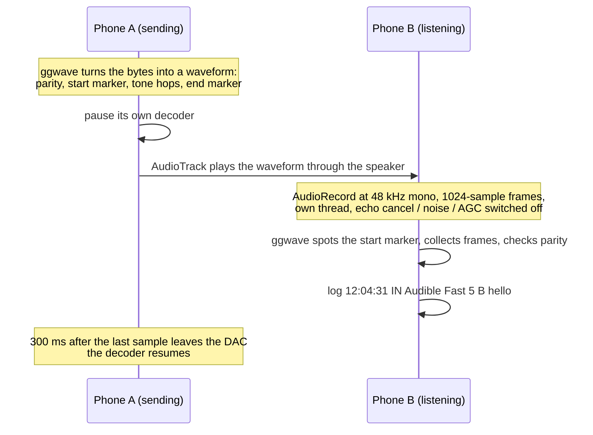

<picture>
  <source media="(prefers-color-scheme: dark)" srcset="docs/hero-dark.svg">
  
</picture>

<sub>The banner is not decoration. It is the word “hello”, encoded by this app with ggwave’s Audible Fast protocol and drawn from the actual 48 kHz waveform: a start marker, five bytes of six-tone hops, an end marker. 1.19 seconds of air.</sub>

# sotto

Type on one phone. It chirps. The other phone hears the chirp and prints your words.

Sotto is a messenger whose only network is the air between a speaker and a microphone. No
pairing, no server, no account, no permission beyond the mic. Both roles live in one Android
app, so any two phones with it installed can talk in either direction, and anything else that
can hear and run ggwave can listen in.

| | |
|---|---|
| **Carrier** | sound. Audible protocols sit around 1.8–6.2 kHz, ultrasound around 15–19 kHz |
| **Payload** | up to 100 bytes of UTF-8 per message (ggwave itself allows 140) |
| **Speed** | 20 bytes in 1.4 to 2.8 s on the audible protocols |
| **Integrity** | Reed–Solomon parity inside ggwave. A message decodes intact or not at all |
| **Stack** | Kotlin, Jetpack Compose, ggwave 0.4.3 in C++ through the NDK, minSdk 26 |
| **Footprint** | four Kotlin files, one C++ file, no dependencies beyond Compose |

## How a message travels



Half duplex, on purpose. A phone never decodes its own chirp because capture keeps running
while transmitting but decoding is gated: off the moment playback starts, back on 300 ms
after `playbackHeadPosition` reports the final sample played. The record buffer never fills
with stale audio, so the first frame after the gate lifts is live.

## The same five bytes, three ways

<picture>
  <source media="(prefers-color-scheme: dark)" srcset="docs/protocols-dark.svg">
  
</picture>

ggwave ships nine protocols this app can transmit with. Ultrasound is the audible code moved
above hearing; dual-tone trades speed for speakers that cannot hold six tones at once. The
receiver decodes all of them at all times, so the two phones do not have to agree on one.
The log tells you which protocol each message arrived on.

| Protocol | Band | 20 bytes | 100 bytes | Reach for it when |
|---|---|---|---|---|
| Audible Normal | 1.8–6.2 kHz | 2.8 s | 9.9 s | the room is loud or the phones are far apart |
| **Audible Fast** (default) | 1.8–6.2 kHz | 2.1 s | 6.8 s | most of the time |
| Audible Fastest | 1.8–6.2 kHz | 1.4 s | 3.8 s | the phones share a table |
| Ultrasound Normal / Fast / Fastest | 15–19 kHz | 2.8 / 2.1 / 1.4 s | 9.9 / 6.8 / 3.8 s | it must be silent to adults. Needs a clear line of sight and hardware that actually reaches 19 kHz; many phones do not |
| Dual-tone Normal / Fast / Fastest | about 1–3 kHz | 6.6 / 4.7 / 2.7 s | 28.1 / 19.0 / 9.8 s | the sending speaker is tiny or the receiver is a cheap mic |

Airtime measured on the host with the vendored ggwave; the app adds 0.1 s of trailing
silence and the 0.3 s guard. ggwave's mono-tone protocols are not offered because they only
work with fixed-length payloads.

## On the screen

- **Listening** switch, a live mic level in dBFS, and the capture source it managed to open
  (`UNPROCESSED`, `VOICE_RECOGNITION` or `MIC`).
- **Message** box with a byte counter. Send greys out above 100 bytes.
- **Protocol** dropdown and a **Tx amplitude** slider (ggwave's `volume`, 5–100, default 30).
- **Test burst**: a fixed 20-byte message ten times, 2 s apart. The receiving phone counts
  `received / 10` so distance and protocol can be scored in one number.
- **Log**: time, direction, protocol, size, text. Newest first.
- A red banner when media volume is under 70%, with a button that opens the volume panel.
- A blocking screen if the microphone permission is refused, with a way into app settings.

## Build

Needs JDK 17, Android SDK platform 36, NDK 28.2.13676358 and CMake 3.22.1, all available from
Android Studio's SDK Manager.

```sh
git clone https://github.com/retrocodes12/sotto
cd sotto
echo "sdk.dir=$HOME/Android/Sdk" > local.properties
./gradlew assembleDebug
adb install -r app/build/outputs/apk/debug/app-debug.apk    # once per phone
```

The debug key signs the APK, so later builds install over the top.

## Range test

1. Install on phone A and phone B. Open the app on both, allow the microphone.
2. Media volume to at least 70% on both. The red banner goes away.
3. Turn on **Listening** on B. Talk; the level meter should move.
4. On A, type something and tap **Send**. Within about two seconds B's log shows the text,
   the time, the protocol and the byte count. Reply from B to A to check the other direction.
5. Now score it. On B tap **Reset** under "Received". On A pick a protocol and tap
   **Send burst**. Forty-five seconds later B shows `n / 10`. Walk apart, repeat. Change
   protocol, repeat. Write the numbers down; they are the whole point of the exercise.
6. `adb logcat -s sotto-jni SoundLink` shows which capture source was opened, which audio
   effects were switched off, and anything ggwave refused.

Things that hurt: a case over the mic, a Bluetooth speaker or headset stealing the output on
the sending phone, "Fastest" in a reverberant room, and ultrasound on hardware that rolls off
before 19 kHz.

## Under the hood

- **ggwave's C++ class, not its C API.** The C functions cannot say which protocol decoded a
  message; `rxProtocolId()` can. The wrapper is 150 lines in `app/src/main/cpp/ggwave_jni.cpp`.
- **Two ggwave instances.** One TX-only for the transmit thread, one RX-only for the capture
  thread. Neither touches the other's buffers, so there are no locks.
- **`UNPROCESSED` only when the device says so.** Android substitutes a processed source on
  phones that lack it, which is worse than falling back to `VOICE_RECOGNITION` deliberately.
  Echo cancellation, noise suppression and automatic gain control are then disabled by name
  on the capture session wherever the device reports them, and the effect objects are held
  until capture stops so the setting cannot revert.
- **Nothing is resampled.** Capture, playback and ggwave's operating rate are all 48 kHz.
- **The decoder is always optimised.** The FFT runs on every 1024-sample frame, so the
  vendored ggwave is compiled with `-O2` even in the debug variant.
- **Amplitude is per tone.** ggwave sums up to six tones, so a `volume` above about 50 clips.
  Clipping mostly survives on the audible protocols and is worth trying at range; it is not
  kind to ultrasound.
- **The artwork is data.** `tools/dumpwave.cpp` writes the waveform ggwave generates for a
  message; `tools/hero.py` draws it as run-length merged SVG rectangles from a rectangular
  window FFT, which is exact here because ggwave's tones sit on FFT bin centres.

## Status

v0. `./gradlew assembleDebug` builds; a host round trip of the wrapper's exact ggwave usage
decodes 27 of 27 cases (nine protocols, three payload sizes, correct protocol id each time).
Numbers from two real phones at real distances are the next thing this README should contain.

## Layout

```
app/src/main/cpp/ggwave_jni.cpp              JNI wrapper: create, encode, decode, protocol names
app/src/main/cpp/ggwave/                     vendored ggwave, commit in VENDORED.md, MIT
app/src/main/java/com/sotto/GgWave.kt        Kotlin face over the wrapper
app/src/main/java/com/sotto/SoundLink.kt     AudioRecord, AudioTrack, half-duplex gate
app/src/main/java/com/sotto/MainViewModel.kt UI state, send, burst counting, log
app/src/main/java/com/sotto/MainActivity.kt  Compose screens and the permission gate
tools/                                       waveform dumper and the README artwork generator
docs/                                        the generated SVGs
```

ggwave is by Georgi Gerganov, MIT licensed, vendored unchanged at the commit named in
`app/src/main/cpp/ggwave/VENDORED.md`.

<sub>sotto, as in <i>sotto voce</i>: said under the breath, meant for one listener.</sub>
