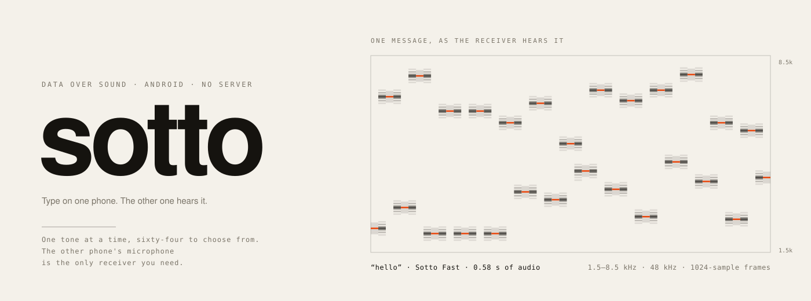
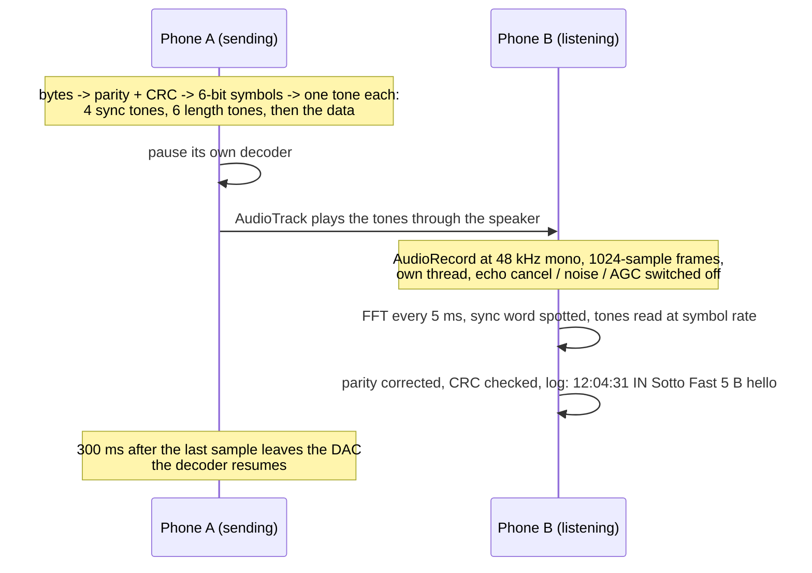
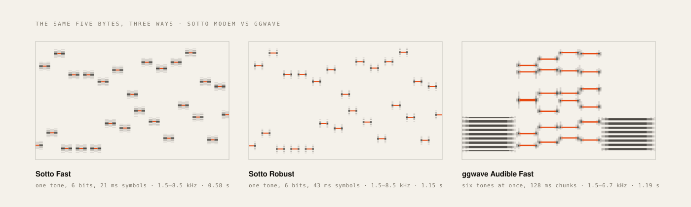

<picture>
  <source media="(prefers-color-scheme: dark)" srcset="docs/hero-dark.svg">
  
</picture>

<sub>The banner is not decoration. It is the word “hello” as this app sends it, drawn from the actual 48 kHz waveform: four sync tones, six tones that spell the length, then 14 bytes of Reed–Solomon-protected data, one tone per six bits. 29 tones, 0.62 seconds of air.</sub>

# sotto

Type on one phone. It chirps. The other phone hears the chirp and prints your words.

Sotto is a messenger whose only network is the air between a speaker and a microphone. No
pairing, no server, no account, no permission beyond the mic. Both roles live in one Android
app, so any two phones with it installed can talk in either direction.

It ships its own modem, written for this app, and keeps [ggwave](https://github.com/ggerganov/ggwave)
next to it so the two can be compared on real phones with the built-in test burst.

| | |
|---|---|
| **Carrier** | one tone at a time, 2.1–8.0 kHz audible or 15–18 kHz ultrasound |
| **Payload** | up to 100 bytes of UTF-8 per message |
| **Speed** | 5 bytes in 0.62 s, 20 bytes in 1.22 s, 100 bytes in 4.1 s |
| **Integrity** | Reed–Solomon parity and a CRC-16. A message decodes intact or not at all |
| **Modem** | 550 lines of C++, 32 KB of decoder heap, 3 ms of CPU per second of audio |
| **Stack** | Kotlin, Jetpack Compose, C++ through the NDK, minSdk 26 |

## How a message travels



Half duplex, on purpose. A phone never decodes its own chirp because capture keeps running
while transmitting but decoding is gated: off the moment playback starts, back on 300 ms
after `playbackHeadPosition` reports the final sample played.

## The modem

A phone speaker is peak limited. ggwave's audible protocols play six tones at once, so each
tone gets a sixth of the amplitude, which is a 36× loss of power per tone before the sound
has left the phone. The Sotto modem plays one tone at a time and chooses it from 64, so every
symbol carries six bits with the whole speaker behind it. That single decision is worth about
15 dB, and the rest of the design spends it on speed and on rooms:

- **Alternating frequency sets.** Odd and even symbols use disjoint sets of 64 tones, so the
  reverberation of one symbol lands on bins the next symbol does not use.
- **Tail cancellation.** During a symbol's window, the other set's bins hold nothing but the
  decaying tail of earlier symbols. Half of that energy is subtracted before the tone is
  picked. It took Fast mode from 96% to 100% in the simulated room.
- **A four-tone sync word** instead of ggwave's two 340 ms markers. Three of the four tones
  must win their set outright and the fourth must place in the top three, so one unlucky
  tone does not lose the frame.
- **The length as six hashed tones, decoded by likelihood.** The receiver scores all 141
  possible lengths against the raw tone energies, at the sync alignment and one FFT hop
  either side, and takes the best. It never snaps on a bad bit, and the winning alignment
  corrects the symbol timing for everything that follows. This replaced a twice-sent
  CRC-4 header after a real-phone burst lost exactly one frame that way.
- **Reed–Solomon plus CRC-16, decoded on a ladder.** Parity scales with the frame (6 to 32
  bytes). Doubtful symbols go in as erasures, then fewer erasures, then none, then chase
  decoding: the six least confident symbols swapped for their runner-up tones in every
  combination until parity and CRC agree. The CRC means noise never decodes to garbage.
- **Streaming.** The decoder delivers the message the moment the last symbol has arrived.
  No end marker, no post-analysis.

<picture>
  <source media="(prefers-color-scheme: dark)" srcset="docs/protocols-dark.svg">
  
</picture>

### Measured against ggwave

`tools/bench.cpp` runs both modems through the same simulated air channel: every waveform
is normalised to the same peak (the speaker's limit), attenuated 20 dB for distance, and hit
with white noise at the level in the header. The room variant adds six early reflections,
a comb-filter reverb tail with an RT60 of 0.35 s, and a random ±8 dB speaker/mic tilt.
20-byte payloads, 24 trials per cell, percentage decoded correctly.

Free field, signal peak −21 dBFS at the microphone:

| noise, dBFS | −40 | −30 | −25 | −20 | −15 | −10 | −5 |
|---|---|---|---|---|---|---|---|
| **Sotto Fast** | 100 | 100 | 100 | 100 | 100 | 100 | 0 |
| **Sotto Robust** | 100 | 100 | 100 | 100 | 100 | 100 | 83 |
| ggwave Normal | 100 | 100 | 100 | 8 | 0 | 0 | 0 |
| ggwave Fast | 100 | 100 | 96 | 0 | 0 | 0 | 0 |
| ggwave Fastest | 100 | 100 | 96 | 0 | 0 | 0 | 0 |

Room, same signal:

| noise, dBFS | −40 | −30 | −25 | −20 | −15 | −10 | −5 |
|---|---|---|---|---|---|---|---|
| **Sotto Fast** | 100 | 100 | 100 | 100 | 67 | 4 | 0 |
| **Sotto Robust** | 100 | 100 | 100 | 100 | 100 | 71 | 0 |
| ggwave Normal | 100 | 92 | 29 | 0 | 0 | 0 | 0 |
| ggwave Fast | 100 | 88 | 38 | 0 | 0 | 0 | 0 |
| ggwave Fastest | 96 | 88 | 25 | 0 | 0 | 0 | 0 |
| ggwave Fast, hard-clipped | 42 | 29 | 46 | 25 | 0 | 0 | 0 |

Sotto Fast keeps decoding with noise 6 dB above the signal's own peak; ggwave stops about
10 dB before that in free field and 15 dB before it in the room. The last row is what
happens when ggwave's six-tone sum is driven past full scale to make it louder: clipping
breaks it even without noise, which is why the app caps ggwave's amplitude at 25.

| | airtime, 20 B | airtime, 100 B | decoder heap | decoder CPU |
|---|---|---|---|---|
| Sotto Fast | 1.22 s | 4.1 s | 32 KB | 2.9 ms per s of audio |
| Sotto Robust | 2.43 s | 8.1 s | 48 KB | 3.1 ms |
| Sotto Ultrasound | 2.82 s | 9.6 s | 40 KB | 3.0 ms |
| ggwave Fast | 2.09 s | 6.8 s | 8.2 MB | 0.6 ms idle, more while analysing |
| ggwave Fastest | 1.39 s | 3.8 s | 8.2 MB | |

The channel is a model. Real speakers, real rooms and real phones are the next thing this
table needs, and the app's test burst exists to get those numbers.

## Protocols

The receiver decodes every protocol at all times, so the two phones do not have to agree on
one. The log tells you which protocol each message arrived on.

| Protocol | Band | Symbol | 20 bytes | Reach for it when |
|---|---|---|---|---|
| **Sotto Fast** (default) | 2.1–8.0 kHz | 21 ms | 1.22 s | most of the time |
| Sotto Robust | 2.1–8.0 kHz, tones 47 Hz apart | 43 ms | 2.43 s | far apart, loud room, or someone is walking |
| Sotto Ultrasound | 15–18 kHz | 43 ms, 5 bits | 2.82 s | it must be silent to adults; needs hardware that reaches 18 kHz |
| ggwave Normal / Fast / Fastest | 1.8–6.2 kHz | 192 / 128 / 64 ms chunks | 2.8 / 2.1 / 1.4 s | comparison, and talking to other ggwave software |
| ggwave Ultrasound ×3 | 15–19 kHz | as above | 2.8 / 2.1 / 1.4 s | same, above hearing |
| ggwave Dual-tone ×3 | about 1–3 kHz | | 6.6 / 4.7 / 2.7 s | tiny speakers |

ggwave's mono-tone protocols are not offered because they only work with fixed-length
payloads.

## On the screen

- **Listening** switch, a live mic level in dBFS, and the capture source it managed to open
  (`UNPROCESSED`, `VOICE_RECOGNITION` or `MIC`).
- **Message** box with a byte counter and, for Sotto protocols, the seconds of audio the
  draft will take. Send greys out above 100 bytes.
- **Protocol** dropdown and a **Tx amplitude** slider (default 100; ggwave protocols are
  capped at 25 so their six-tone sum does not clip).
- **Test burst**: a fixed 20-byte message ten times, 2 s apart. The receiving phone counts
  `received / 10`, so distance, room and modem can be scored in one number.
- **Log**: time, direction, protocol, size, text. Newest first.
- A banner whenever media volume is under 100%, red under 70%, with a button that opens
  the volume panel. Every 6 dB of speaker level doubles the range.
- A blocking screen if the microphone permission is refused, with a way into app settings.

## Install

No toolchain needed to try it: the [latest release](https://github.com/retrocodes12/sotto/releases/latest)
carries a debug-signed APK. Put it on both phones and open it, or from a computer:

```sh
adb install -r sotto-v0.2-debug.apk
```

## Build

Needs JDK 17, Android SDK platform 36, NDK 28.2.13676358 and CMake 3.22.1, all available from
Android Studio's SDK Manager.

```sh
git clone https://github.com/retrocodes12/sotto
cd sotto
echo "sdk.dir=$HOME/Android/Sdk" > local.properties
./gradlew assembleDebug
adb install -r app/build/outputs/apk/debug/app-debug.apk    # once per phone
```

The debug key signs the APK, so later builds install over the top. The host benchmark and
the artwork tools build with plain `g++`; the commands are in their headers.

## Range test

1. Install on phone A and phone B. Open the app on both, allow the microphone.
2. Media volume to at least 70% on both. The red banner goes away.
3. Turn on **Listening** on B. Talk; the level meter should move.
4. On A, type something and tap **Send**. Within about a second B's log shows the text,
   the time, the protocol and the byte count. Reply from B to A to check the other direction.
5. Now score it. On B tap **Reset** under "Received". On A tap **Send burst**. Half a minute
   later B shows `n / 10`. Switch A to **ggwave Fast** and send the burst again from the same
   spot. Walk apart, repeat both. Write the numbers down; they are the whole point.
6. `adb logcat -s sotto-jni SoundLink Sotto` shows the capture source, which audio effects
   were switched off, every sync the modem found, and for every frame the mean tone level,
   the noise floor per bin, the SNR, the received level across eight slices of the band,
   and why it was dropped if it was.

Things that hurt: a case over the mic, a Bluetooth speaker or headset stealing the output on
the sending phone, and ultrasound on hardware that rolls off before 18 kHz.

## Under the hood

- **One engine, two modems.** `cpp/jni_bridge.cpp` encodes with whichever protocol was
  chosen and feeds every decoder the same capture stream. ggwave is driven through its C++
  class rather than its C API because only the class reports which protocol decoded.
- **`UNPROCESSED` only when the device says so.** Android substitutes a processed source on
  phones that lack it, which is worse than falling back to `VOICE_RECOGNITION` deliberately.
  Echo cancellation, noise suppression and automatic gain control are then disabled by name
  on the capture session, and the effect objects are held until capture stops.
- **Nothing is resampled.** Capture, playback and both modems run at 48 kHz.
- **Rectangular windows on purpose.** Tones sit exactly on FFT bin centres, so a rectangular
  window over one symbol gives one clean bin per tone; the receiver's FFT is a real-input
  N/2 transform with the split done only for the 128 bins of the band.
- **Everything native is compiled `-O2`** even in the debug variant. The decoders run on the
  capture thread on every frame.
- **The artwork is data.** `tools/dumpwave.cpp` writes the waveform a modem generates for a
  message; `tools/hero.py` draws it as run-length merged SVG rectangles.

## Status

v0.3. First contact on real hardware (two phones, Sotto Ultrasound): 10 of 10 at 25 cm with
30 dB of SNR, 9 of 10 at about a metre with 25 dB. The one miss was a header lost to a
timing slip, which is what the likelihood header now fixes. More distances, the audible
modes and the ggwave comparison on the same phones are next.

## Layout

```
app/src/main/cpp/sotto_modem.h, .cpp         the modem: encoder and streaming decoder
app/src/main/cpp/jni_bridge.cpp              JNI: create, encode, decode, protocol names
app/src/main/cpp/ggwave/                     vendored ggwave, commit in VENDORED.md, MIT
app/src/main/java/com/sotto/Modem.kt         Kotlin face over the engine
app/src/main/java/com/sotto/SoundLink.kt     AudioRecord, AudioTrack, half-duplex gate
app/src/main/java/com/sotto/MainViewModel.kt UI state, send, burst counting, log
app/src/main/java/com/sotto/MainActivity.kt  Compose screens and the permission gate
tools/bench.cpp                              the channel simulation and the tables above
tools/dumpwave.cpp, hero.py                  the README artwork
docs/                                        the generated SVGs
```

The modem reuses the Reed–Solomon implementation vendored with ggwave (Mike Lubinets, MIT).
ggwave is by Georgi Gerganov, MIT licensed, vendored unchanged at the commit named in
`app/src/main/cpp/ggwave/VENDORED.md`.

<sub>sotto, as in <i>sotto voce</i>: said under the breath, meant for one listener.</sub>
